# Chapter 20 — Kafka Troubleshooting Deep Dive: Diagnosis, Metrics, Incidents & Recovery

> **Certification focus:** CCAAK primary, CCDAK overlap
> **Goal:** develop a repeatable, evidence-driven method for diagnosing Kafka incidents.

---

## 20.1 Learning Objectives

You should be able to:

- identify and scope Kafka incidents
- use metrics, logs and effective configuration as evidence
- distinguish symptoms from root causes
- diagnose broker, storage, network and JVM pressure
- diagnose producer latency and failures
- diagnose consumer lag and rebalances
- distinguish under-replicated from offline partitions
- diagnose ISR instability and broker failures
- troubleshoot KRaft/controller problems
- separate authentication from authorization
- troubleshoot Kafka Connect and Kafka Streams
- apply safe mitigation and recovery procedures

---

## 20.2 The Golden Troubleshooting Rule

> **Do not start with "What configuration should I change?" Start with "What evidence tells me what is failing?"**

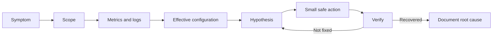

---

## 20.3 Define the Symptom

Replace:

> Kafka is slow.

with something measurable:

- producer p99 latency increased
- consumer lag is increasing
- broker 2 has high disk latency
- partitions are under-replicated
- clients receive connection timeouts
- consumers rebalance repeatedly

A precise symptom reduces the search space.

---

## 20.4 Determine the Blast Radius

Ask whether the failure affects:

- one client
- one consumer group
- one topic
- one partition
- one broker
- multiple brokers
- the whole cluster

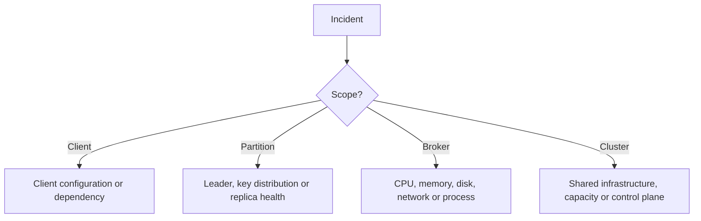

---

## 20.5 Establish a Timeline

Correlate the first abnormal signal with recent changes:

- deployment
- configuration change
- certificate rotation
- topic expansion
- broker restart
- traffic increase
- infrastructure change

Example:

```text
10:00  normal
10:05  deployment
10:07  producer latency increases
10:08  ISR shrinks
10:09  consumer lag increases
10:15  mitigation
10:20  recovery
```

The first abnormal signal is often more useful than the loudest later symptom.

---

## 20.6 Cluster Health First

Useful commands:

```bash
kafka-topics.sh --bootstrap-server kafka-1:9092 --describe
```

```bash
kafka-consumer-groups.sh   --bootstrap-server kafka-1:9092   --describe   --group orders
```

```bash
kafka-configs.sh   --bootstrap-server kafka-1:9092   --entity-type topics   --entity-name orders   --describe
```

Exact CLI options vary by Kafka version. Use `--help` for the installed version.

---

## 20.7 Metrics Before Guessing

Important metric families include:

- request latency
- request queue time
- request processing time
- network processor idle
- request handler idle
- bytes in/out
- connection counts
- disk utilization and latency
- replication health
- under-replicated partitions
- offline partitions
- JVM heap and GC
- controller/KRaft health

Metrics establish the shape of the incident; logs provide detailed events.

---

## 20.8 Broker Resource Diagnosis

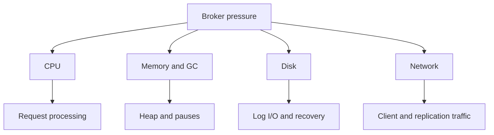

Do not increase threads, heap or timeouts before identifying the constrained resource.

---

## 20.9 Request Handler and Network Processor Pressure

Low request-handler idle time can indicate broker request-processing pressure.

Low network processor idle time can indicate network-processing pressure.

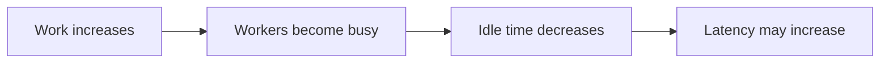

Next determine whether the workload is CPU-bound, I/O-bound or blocked by another dependency.

---

## 20.10 Disk Bottleneck

Kafka relies heavily on the filesystem and operating-system page cache.

Symptoms can include:

- request latency increases
- replication falls behind
- ISR shrinks
- recovery takes longer
- consumer fetch latency increases

Check:

```bash
df -h
df -i
```

Then inspect disk latency, throughput, IOPS, filesystem capacity and Kafka log directories.

A full filesystem is an availability risk, not merely a cleanup problem.

---

## 20.11 JVM Heap, GC and Page Cache

Increasing JVM heap is not automatically a performance improvement.

Kafka needs memory for:

- JVM heap
- operating-system filesystem cache
- other processes

A very large heap can increase GC pressure and reduce memory available for page cache.

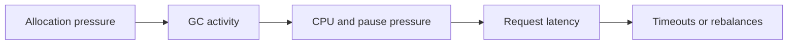

Confirm the chain with JVM and host metrics before changing heap.

---

## 20.12 Producer Troubleshooting

Producer latency is a pipeline:

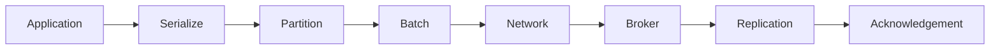

Potential causes:

- insufficient batching
- broker overload
- network latency
- replication delay
- hot partition
- message-size limits
- metadata problems
- authentication/authorization
- application-side serialization

---

## 20.13 Producer Failure Matrix

| Symptom | First areas to investigate |
|---|---|
| Timeout | broker load, network, partition leadership, replication, metadata |
| Record too large | producer, broker, replica-fetch and consumer size limits |
| Authentication failure | security protocol, SASL mechanism, credentials |
| Authorization failure | principal and ACLs |
| High latency | batching, network, broker, replication, hot partitions |

Do not increase retries before understanding the failure.

---

## 20.14 Consumer Lag Is a Symptom

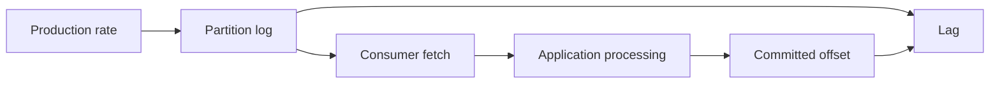

Possible causes:

- slow application processing
- too few consumers
- too few partitions
- hot partition
- downstream database latency
- repeated rebalances
- network bottleneck
- serialization/deserialization cost

---

## 20.15 Lag Trend Matters

### Increasing

The consumer is falling further behind.

### High but stable

There is a persistent backlog, but consumption is keeping pace with incoming traffic.

### Decreasing

Recovery is occurring.

The trend is often more useful than one lag snapshot.

---

## 20.16 Consumer Rebalances

Repeated rebalances can result from:

- consumer crashes
- missed heartbeats
- excessive processing time
- unstable network
- group membership changes
- long JVM pauses

Do not automatically increase every timeout.

First identify why members are leaving and rejoining.

---

## 20.17 Poll-Loop Problem

A consumer that processes records for too long can stop polling frequently enough.

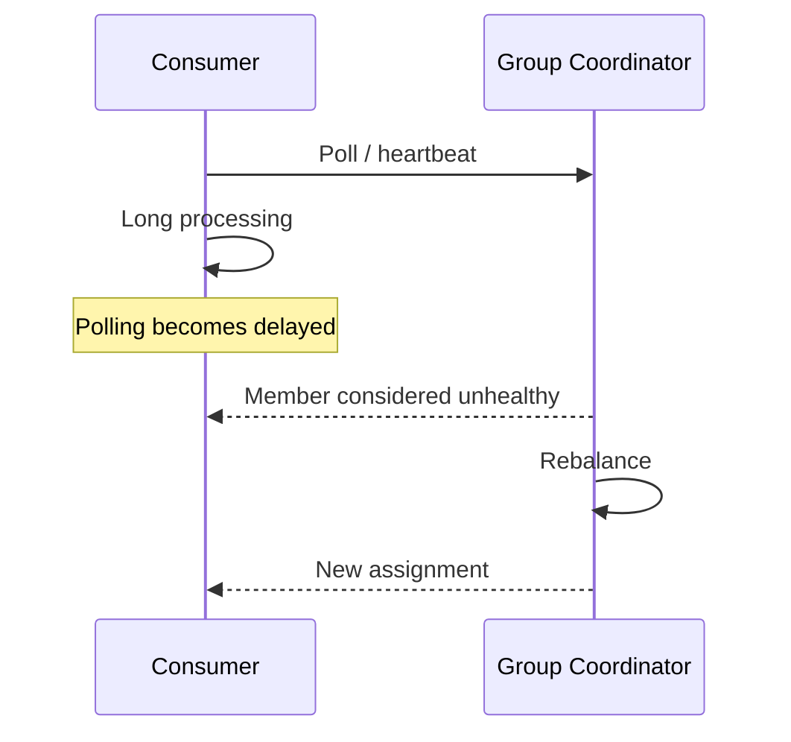

Potential remedies include:

- reduce processing time
- reduce records processed per cycle
- increase application parallelism appropriately
- move expensive work outside the poll loop
- tune consumer settings based on measured workload

---

## 20.18 Consumer Group Parallelism

For a topic with 12 partitions:

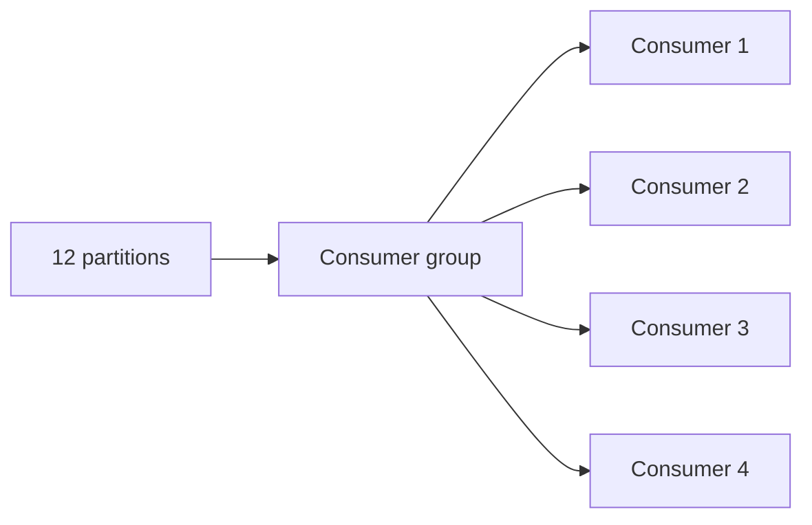

Adding consumers beyond available partition parallelism does not create additional partition-level parallelism.

---

## 20.19 Hot Partition

Symptoms:

- one partition has much more traffic
- one consumer is overloaded
- lag is concentrated on one partition
- overall cluster utilization may still look acceptable

Possible causes:

- skewed key distribution
- hot business key
- partitioning strategy

Adding consumers does not split one partition across consumers.

---

## 20.20 Under-Replicated Partitions

Under-replication means fewer replicas are currently in sync than the configured replica set.

Potential causes:

- broker failure
- disk bottleneck
- network bottleneck
- replication overload
- broker pause
- insufficient capacity

Under-replication is serious, but it is not the same as partition unavailability.

---

## 20.21 Offline Partitions

An offline partition has no available leader.

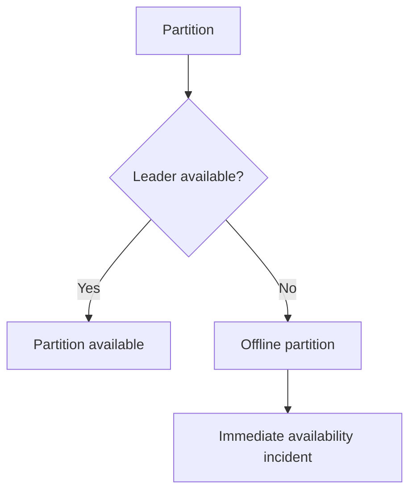

Prioritize restoring partition availability before optimizing secondary symptoms.

---

## 20.22 ISR Shrinkage

Repeated ISR shrink/expand cycles indicate instability.

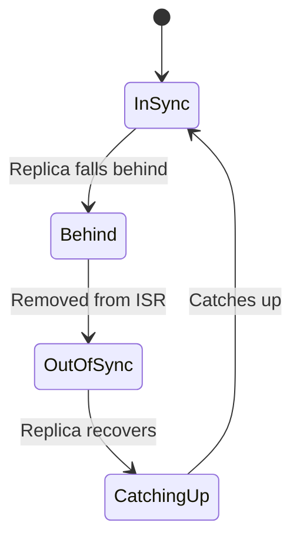

Investigate disk, network, broker pauses and replication capacity.

---

## 20.23 Broker Failure and Recovery

When a broker fails:

1. identify affected partitions
2. determine leaders
3. inspect ISR
4. check for offline partitions
5. monitor recovery
6. verify redundancy is restored

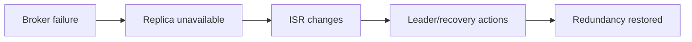

Do not stop at "the broker restarted." Verify the cluster state.

---

## 20.24 Recovery Capacity

Recovery consumes resources.

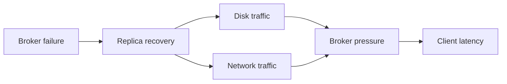

Too much recovery traffic can hurt client workloads.

Too little recovery traffic prolongs reduced redundancy.

---

## 20.25 Leader Imbalance

If one broker owns disproportionately many partition leaders, request and network load can become uneven.

Inspect:

- leader distribution
- partition distribution
- broker bytes in/out
- request load

Do not resize every broker before checking distribution.

---

## 20.26 KRaft / Controller Troubleshooting

Investigate:

- controller quorum health
- controller/broker connectivity
- controller logs
- metadata propagation
- node roles
- CPU
- disk
- network

A metadata/control-plane problem can manifest as client metadata failures.

---

## 20.27 Authentication vs Authorization

Use the layered sequence:

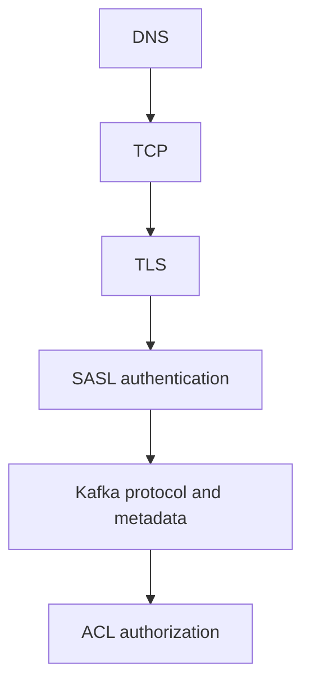

If SASL fails, do not begin with ACLs.

If authentication succeeds and the operation is denied, investigate authorization.

---

## 20.28 Retention Seems Late

Retention is segment-oriented and asynchronous.

Investigate:

- `retention.ms`
- `retention.bytes`
- `segment.ms`
- `segment.bytes`
- cleanup policy
- actual segment state

Do not assume every record is deleted at the exact instant its age threshold is reached.

---

## 20.29 Log Compaction

Compaction is asynchronous.

A compacted topic may temporarily contain multiple records for the same key.

Investigate:

- `cleanup.policy`
- cleaner activity
- compaction backlog
- tombstones
- segment state
- disk pressure

---

## 20.30 Configuration Troubleshooting

Kafka settings exist at different scopes:

- broker
- topic
- producer
- consumer
- listener
- dynamic broker configuration
- environment/container configuration

When a value looks wrong, ask:

> **Which component owns this setting, and what is the effective value?**

Do not assume the file you edited is the effective configuration.

---

## 20.31 Useful Investigation Commands

### Topic

```bash
kafka-topics.sh --bootstrap-server kafka-1:9092 --describe --topic orders
```

### Consumer group

```bash
kafka-consumer-groups.sh   --bootstrap-server kafka-1:9092   --describe   --group orders
```

### Topic configuration

```bash
kafka-configs.sh   --bootstrap-server kafka-1:9092   --entity-type topics   --entity-name orders   --describe
```

### Broker configuration

```bash
kafka-configs.sh   --bootstrap-server kafka-1:9092   --entity-type brokers   --entity-default   --describe
```

Use `--help` for the exact syntax supported by the installed Kafka version.

---

## 20.32 Logs and Evidence

Correlate:

- timestamp
- broker
- thread
- exception
- partition
- client
- request/correlation information where available

One isolated exception is different from the same exception across every broker.

---

## 20.33 Evidence Hierarchy

Prefer:

1. direct metric
2. broker/client log
3. effective configuration
4. reproducible network test
5. recent change
6. assumption

Example:

> "The disk seems fine."

is weaker than:

```text
disk latency: 35 ms -> 240 ms
```

---

## 20.34 Change One Thing at a Time

Avoid changing several unrelated variables simultaneously.

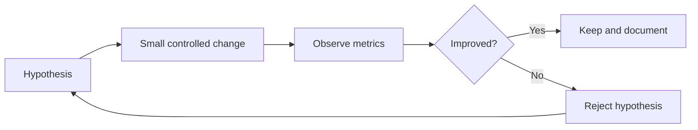

---

## 20.35 Safe Incident Response

During an incident:

1. protect availability
2. protect durability
3. reduce blast radius
4. collect evidence
5. apply the smallest safe mitigation
6. monitor recovery
7. perform root-cause analysis after stabilization

Do not manually delete Kafka log files as emergency cleanup.

---

## 20.36 Kafka Connect Troubleshooting

Separate the layers:

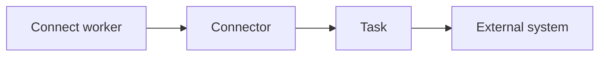

A healthy worker does not imply a healthy connector or task.

Check worker state, connector state, task state, task logs, serialization/schema, external-system health, authentication and network.

---

## 20.37 Kafka Streams Troubleshooting

Separate:

- application process
- input topics
- stream task
- state store
- changelog
- repartition topic
- output topic

A healthy JVM process does not prove that every Streams task is healthy.

---

## 20.38 Scenario — Producer Latency

Evidence:

- CPU normal
- network normal
- disk latency high
- ISR shrinking

Likely diagnosis:

> Storage pressure is affecting broker/replication performance.

Do not begin by increasing producer retries.

---

## 20.39 Scenario — One Partition Has Lag

Evidence:

- other partitions healthy
- one partition has much higher traffic
- assigned consumer is saturated

Likely diagnosis:

> Hot partition / key skew.

Investigate partitioning rather than simply adding consumers.

---

## 20.40 Scenario — Rebalances After Deployment

Evidence:

- processing time increased after deployment
- broker metrics remain healthy
- consumers stop polling in time

Likely diagnosis:

> Consumer application processing/poll-loop regression.

---

## 20.41 Scenario — One Broker Has High CPU

Evidence:

- one broker has disproportionate leader count
- other brokers are normal

First investigate:

> leader/partition imbalance.

---

## 20.42 Scenario — Authentication Failure

Evidence:

```text
TCP = OK
TLS = OK
SASL = FAIL
```

Diagnosis:

> Authentication layer.

Check the SASL mechanism, credentials and listener-specific configuration.

---

## 20.43 Scenario — Authorization Failure

Evidence:

```text
TCP = OK
TLS = OK
SASL = OK
operation = DENIED
```

Diagnosis:

> Authorization/ACL layer.

---

## 20.44 Scenario — Bootstrap Works, Metadata Broker Fails

Likely areas:

- `advertised.listeners`
- DNS
- routing
- firewall/security groups
- broker port
- internal/external listener design

See Chapter 19 for the networking diagnostic model.

---

## 20.45 Scenario — Disk Nearly Full

Ask:

1. Which broker?
2. Which log directory?
3. Which topics consume the space?
4. What are retention settings?
5. Is compaction involved?
6. Are segments rolling?
7. Is recovery generating additional traffic?
8. Is sufficient headroom available?

Do not blindly delete Kafka log files.

---

## 20.46 Scenario — High GC and Latency

Confirm the relationship with JVM metrics and logs:

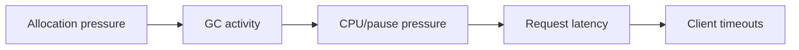

Do not change heap merely because latency increased.

---

## 20.47 Scenario — Network Saturation

If network utilization is high:

- identify client traffic
- identify replication traffic
- identify cross-AZ/region traffic
- inspect connection counts
- inspect record size
- inspect broker distribution

Determine which traffic class is consuming bandwidth.

---

## 20.48 Certification Trap Matrix

| Trap | Correct reasoning |
|---|---|
| Lag means Kafka is broken | Lag is a symptom; diagnose the consumer path |
| Under-replicated means unavailable | Offline partitions represent leader unavailability |
| Add consumers to every lag problem | Parallelism is partition-bound |
| Give Kafka more heap | Diagnose heap, GC and page-cache behavior |
| Increase retries | Identify the underlying failure first |
| Increase timeouts | Identify why requests are slow |
| Delete log files when disk is full | Use controlled Kafka retention/cleanup procedures |
| Authentication failure means ACL failure | Authentication precedes authorization |

---

## 20.49 The 20-Second Diagnostic Model

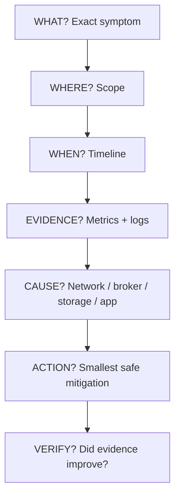

---

## 20.50 CCAAK Troubleshooting Mental Model

Classify the problem first:

```text
NETWORK
SECURITY
BROKER
STORAGE
REPLICATION
PARTITIONING
PRODUCER
CONSUMER
CONTROLLER
CONNECT
STREAMS
CAPACITY
CONFIGURATION
```

Then narrow from symptom to evidence.

---

## 20.51 Senior Troubleshooting Checklist

Before changing anything:

- [ ] define the symptom
- [ ] determine scope
- [ ] establish timeline
- [ ] inspect cluster health
- [ ] inspect metrics
- [ ] inspect logs
- [ ] inspect effective configuration
- [ ] test network if relevant
- [ ] check security if relevant
- [ ] check dependencies
- [ ] form a hypothesis
- [ ] choose the smallest safe action
- [ ] verify recovery
- [ ] document root cause

---

## 20.52 Final Cheat Sheet

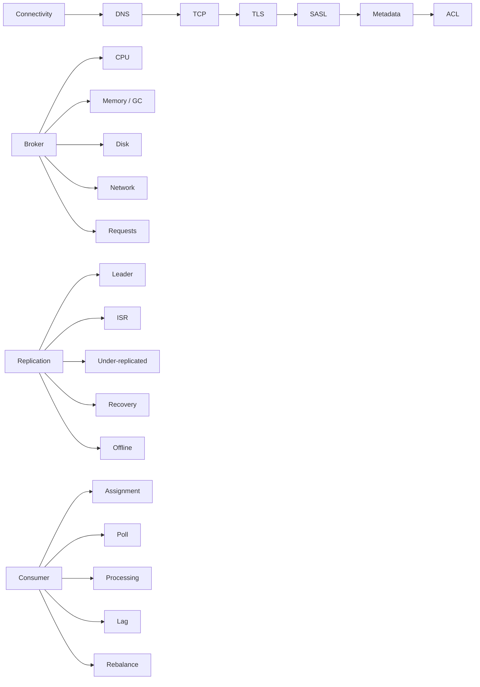

---

## 20.53 Chapter Summary

Senior Kafka troubleshooting is a reasoning discipline.

The strongest certification answers:

1. identify the exact symptom
2. establish scope
3. establish the timeline
4. collect direct evidence
5. separate layers
6. form a hypothesis
7. make the smallest safe change
8. verify the result

For CCAAK, pay particular attention to:

- under-replicated vs offline partitions
- ISR behavior
- broker resource bottlenecks
- consumer lag and rebalances
- networking layers
- authentication vs authorization
- KRaft/controller health
- effective configuration
- recovery capacity
- metrics-driven diagnosis

---

## 20.54 Cross-References

- **Chapter 13:** Monitoring, Metrics & Troubleshooting
- **Chapter 18:** Production Configuration, Tuning & Capacity
- **Chapter 19:** Networking, Listeners, Protocols & Connectivity
- **Chapter 21:** Security
- **Chapter 22:** Certification Scenario Drills


## 20.77 Mermaid — Incident Diagnosis Loop

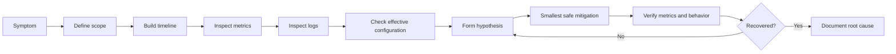

## 20.78 Mermaid — Consumer Lag Diagnosis

```mermaid
flowchart TD
    A[Consumer lag increases] --> B{Lag concentrated?}
    B -- One partition --> C[Hot partition / key skew / slow assigned consumer]
    B -- Many partitions --> D{Consumers processing slowly?}
    D -- Yes --> E[Application / downstream dependency]
    D -- No --> F{Rebalances occurring?}
    F -- Yes --> G[Poll loop / heartbeat / membership / network]
    F -- No --> H{Broker fetch path healthy?}
    H -- No --> I[Broker disk / network / request pressure]
    H -- Yes --> J[Check consumer capacity and partition parallelism]
```
