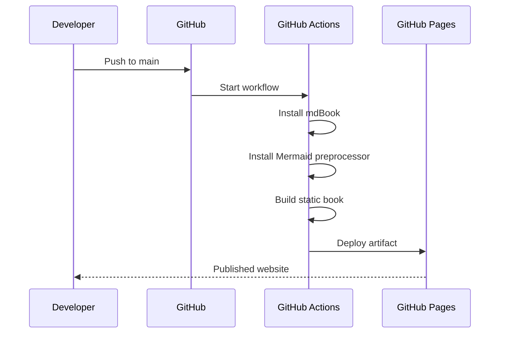
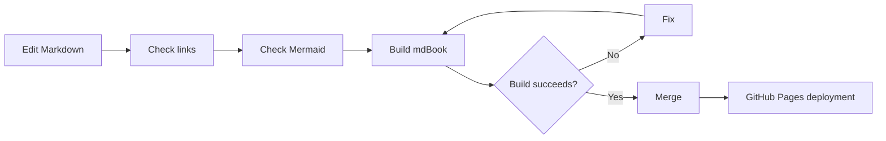

# Website Deployment Strategy

## Recommended architecture

Use **mdBook + Mermaid + GitHub Actions + GitHub Pages**.


## Why this fits the project

### Markdown remains the source of truth

The chapters remain easy to edit, diff and review.

### mdBook provides the book experience

It gives the project:

- navigation
- sidebar
- previous/next chapter navigation
- client-side search
- code highlighting
- responsive rendering
- static HTML output

### Mermaid replaces large ASCII schemas

Architecture, data flow and diagnostic diagrams are maintained as text inside Markdown.

Example:


This makes diagrams easier to update and keeps the repository portable.

### GitHub Pages is the hosting layer

The generated `book/` directory is a static website. GitHub Pages hosts the generated artifact; no application server is required.

## Deployment flow



## One-time GitHub configuration

In the repository:

**Settings → Pages → Build and deployment → Source → GitHub Actions**

The repository's workflow is already prepared for this model.

## Repository workflow

```text
main
 |
 +-- Markdown changes
 |
 v
GitHub Actions
 |
 +-- build
 |
 +-- Mermaid rendering
 |
 +-- upload Pages artifact
 |
 v
GitHub Pages
```

## Branch strategy

Recommended:

```text
main
 |
 +-- stable published book

feature/chapter-xx-...
 |
 +-- chapter/content changes

feature/website-...
 |
 +-- theme/deployment changes
```

Only `main` should publish the production study website.

Pull requests can be used for review before merging.

## Quality gate

Before merging a documentation change:



## Version pinning

The workflow pins:

- mdBook
- mdbook-mermaid

This makes CI builds reproducible instead of silently changing when upstream releases a new version.

When upgrading either dependency:

1. test locally
2. update the version in the workflow
3. update `scripts/setup-docs.sh`
4. build the complete book
5. inspect Mermaid diagrams
6. merge

## Custom domain

If the project later gets a dedicated domain, GitHub Pages supports custom domains. The domain configuration should be added through the repository's Pages settings rather than relying only on a `CNAME` file.

## What should not be committed

Do not commit:

- generated `book/`
- local IDE metadata
- temporary build files
- personal credentials
- GitHub tokens
- cloud credentials

The repository should contain the Markdown source and reproducible build/deployment configuration.
